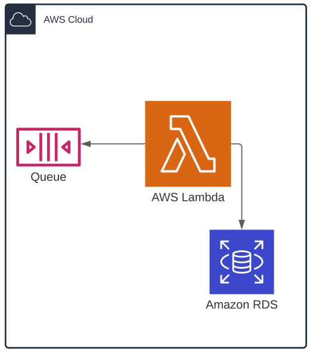

# IoT-People-Counter

###### description

## Front End

## IoT

The IoT Solution cosists of two components:
* ESP32
* VL53L1X Lidar Sensor

Data is published to AWS IoT Core via MQTT using our WiFiConnector & AWSIoTConnector Libraries

An IoT Rule automatically moves messages recieved in IoT to SQS for processing

Written using Arduino (C++)

## Backend

The backend consists of few AWS services
* AWS Lambda
* AWS SQS
* AWS RDS

The lambda is triggered when there is a new message in the Queue
