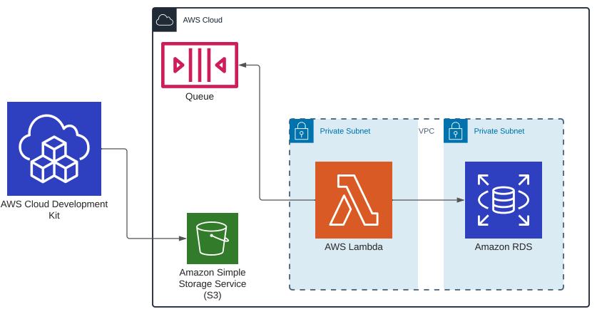

# IoT-People-Counter

###### description

## Front End

## IoT

The IoT Solution cosists of two components:
* ESP32
* VL53L1X Lidar Sensor

Data is published to AWS IoT Core via MQTT using our WiFiConnector & AWSIoTConnector Libraries

An IoT Rule automatically moves messages recieved in IoT to SQS for processing

Written using Arduino (C++)

## Backend

The backend consists of few AWS services
* AWS Lambda
* AWS SQS
* AWS RDS
* AWS VPC with subnets
* CDK with S3 bucket for development

When the SQS receives messages, lambda is triggered. It reads messages from the SQS and 
store them in RDS.

######Deploy to AWS

######Prerequisite
* Java 11
* NodeJs > 11
* TypeScript
* Gradle

After installing the above technologies, run ``npm i -g aws-cdk``
Help:

* https://github.com/aws/aws-cdk
* https://docs.aws.amazon.com/cdk/latest/guide/getting_started.html

Assuming that you have cloned this repo, navigate to
AWSIoTLambda/IoTLambda then run ``./generate_aws_account_file.sh`` script
You will be prompted to enter your AWS Account ID (the account where to deploy),
 the region (https://docs.aws.amazon.com/AmazonRDS/latest/UserGuide/Concepts.RegionsAndAvailabilityZones.html),
the admin username for the database, and the database name.

This should create two files, aws_account.ts and aws_account.txt

before deploying to AWS, we must build Java code, navigate to ../IoTLambdaHandler and run ``./2-build-layer.sh``
this should create a folder named build

under the created folder, verify that there is distributions/IoTLambdaHandler.zip folder.

Now, everything is ready to be deployed to AWS, navigate back to ../IoTLambda and run
``./deploy``

it will take time for the first time. Enter y when prompted.
if all greens, voilà, the backend should be in your AWS accounts under the region
you entered earlier. You can find this info in either was_account.ts or aws_account.txt

